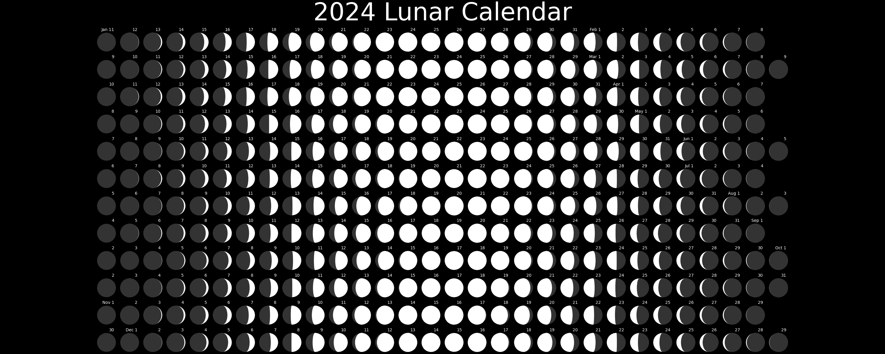

# Moonbox

Pull data from [US Naval Observatory API](https://aa.usno.navy.mil/data/api) about the moon, and display it in a nice way.

## Lunar calendar

As an experiment, I made this lunar calendar. Most lunar calendars you can find online are organized by solar month, with moon phases annotated. Here I take a moon-first approach, putting the [lunar months](https://en.wikipedia.org/wiki/Lunar_month), each starting with the new moon, on the rows. The dates in the normal, solar calendar are annotations.

Note that though there are 12 lunar months "in" 2024, they are only 29 or 30 days long, because the synodic month is 29.53 days.

## Getting started

- Use [poetry](https://python-poetry.org/)
- Run `scripts/eda.ipynb` to make a lunar calendar

## Author

Scott Olesen <swo@alum.mit.edu>
